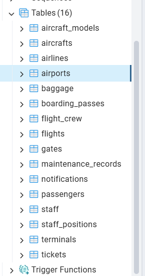

# База данных: Аэропорт  
## Тема: Управление данными аэропорта


* `airports` — аэропорты
* `terminals` — терминалы
* `gates` — посадочные выходы (гейты)
* `airlines` — авиакомпании
* `aircraft_models` — модели самолётов
* `aircrafts` — самолёты
* `flights` — рейсы
* `passengers` — пассажиры
* `tickets` — билеты
* `staff_positions` — должности сотрудников
* `staff` — сотрудники
* `flight_crew` — экипажи на рейсах
* `maintenance_records` — записи техобслуживания
* `baggage` — багаж пассажиров
* `boarding_passes` — посадочные талоны
* `notifications` — уведомления для пассажиров
* `flight_logs` — лог операций с рейсами
* `ticket_logs` — лог операций с билетами
  


---

##   таблицы для БД "Аэропорт"

 Таблица 1: `airports` — Информация об аэропортах
```sql
CREATE TABLE airports (
    airport_id SERIAL PRIMARY KEY,
    name VARCHAR(255) NOT NULL,
    city VARCHAR(255) NOT NULL,
    country VARCHAR(255) NOT NULL,
    iata_code CHAR(3) UNIQUE NOT NULL,
    icao_code CHAR(4) UNIQUE NOT NULL,
    timezone VARCHAR(50),
    created_at TIMESTAMP DEFAULT CURRENT_TIMESTAMP,
    updated_at TIMESTAMP DEFAULT CURRENT_TIMESTAMP
);
```

---

 Таблица 2: `terminals` — Терминалы в аэропортах
```sql
CREATE TABLE terminals (
    terminal_id SERIAL PRIMARY KEY,
    airport_id INTEGER REFERENCES airports(airport_id),
    name VARCHAR(100) NOT NULL,
    description TEXT,
    created_at TIMESTAMP DEFAULT CURRENT_TIMESTAMP,
    updated_at TIMESTAMP DEFAULT CURRENT_TIMESTAMP
);
```

---

 Таблица 3: `gates` — Посадочные выходы (гейты)
```sql
CREATE TABLE gates (
    gate_id SERIAL PRIMARY KEY,
    terminal_id INTEGER REFERENCES terminals(terminal_id),
    gate_number VARCHAR(10) NOT NULL UNIQUE,
    status VARCHAR(50) CHECK (status IN ('active', 'maintenance', 'closed')),
    created_at TIMESTAMP DEFAULT CURRENT_TIMESTAMP,
    updated_at TIMESTAMP DEFAULT CURRENT_TIMESTAMP
);
```

---

 Таблица 4: `airlines` — Авиакомпании
```sql
CREATE TABLE airlines (
    airline_id SERIAL PRIMARY KEY,
    name VARCHAR(255) NOT NULL,
    iata_code CHAR(2),
    icao_code CHAR(3),
    country VARCHAR(100),
    created_at TIMESTAMP DEFAULT CURRENT_TIMESTAMP,
    updated_at TIMESTAMP DEFAULT CURRENT_TIMESTAMP
);
```

---

 Таблица 5: `aircraft_models` — Модели самолётов
```sql
CREATE TABLE aircraft_models (
    model_id SERIAL PRIMARY KEY,
    manufacturer VARCHAR(100) NOT NULL,
    model_name VARCHAR(100) NOT NULL,
    capacity INTEGER NOT NULL,
    range_km INTEGER,
    created_at TIMESTAMP DEFAULT CURRENT_TIMESTAMP,
    updated_at TIMESTAMP DEFAULT CURRENT_TIMESTAMP
);
```

---

 Таблица 6: `aircrafts` — Конкретные самолёты
```sql
CREATE TABLE aircrafts (
    aircraft_id SERIAL PRIMARY KEY,
    model_id INTEGER REFERENCES aircraft_models(model_id),
    registration_number VARCHAR(50) UNIQUE NOT NULL,
    airline_id INTEGER REFERENCES airlines(airline_id),
    status VARCHAR(50) CHECK (status IN ('active', 'maintenance', 'grounded')),
    purchase_date DATE,
    last_maintenance_date DATE,
    created_at TIMESTAMP DEFAULT CURRENT_TIMESTAMP,
    updated_at TIMESTAMP DEFAULT CURRENT_TIMESTAMP
);
```

---

 Таблица 7: `flights` — Рейсы
```sql
CREATE TABLE flights (
    flight_id SERIAL PRIMARY KEY,
    flight_number VARCHAR(20) NOT NULL,
    airline_id INTEGER REFERENCES airlines(airline_id),
    departure_airport_id INTEGER REFERENCES airports(airport_id),
    arrival_airport_id INTEGER REFERENCES airports(airport_id),
    departure_time TIMESTAMP NOT NULL,
    arrival_time TIMESTAMP NOT NULL,
    status VARCHAR(50) CHECK (status IN ('scheduled', 'delayed', 'cancelled', 'on time', 'landed')),
    aircraft_id INTEGER REFERENCES aircrafts(aircraft_id),
    gate_id INTEGER REFERENCES gates(gate_id),
    created_at TIMESTAMP DEFAULT CURRENT_TIMESTAMP,
    updated_at TIMESTAMP DEFAULT CURRENT_TIMESTAMP
);
```

---

 Таблица 8: `passengers` — Пассажиры
```sql
CREATE TABLE passengers (
    passenger_id SERIAL PRIMARY KEY,
    first_name VARCHAR(100) NOT NULL,
    last_name VARCHAR(100) NOT NULL,
    passport_number VARCHAR(20) UNIQUE NOT NULL,
    nationality VARCHAR(100) NOT NULL,
    birth_date DATE NOT NULL,
    email VARCHAR(255),
    phone VARCHAR(20),
    created_at TIMESTAMP DEFAULT CURRENT_TIMESTAMP,
    updated_at TIMESTAMP DEFAULT CURRENT_TIMESTAMP
);
```

---

 Таблица 9: `tickets` — Билеты
```sql
CREATE TABLE tickets (
    ticket_id SERIAL PRIMARY KEY,
    passenger_id INTEGER REFERENCES passengers(passenger_id),
    flight_id INTEGER REFERENCES flights(flight_id),
    seat_number VARCHAR(10) NOT NULL,
    class VARCHAR(50) CHECK (class IN ('economy', 'business', 'first')),
    price NUMERIC(10, 2) NOT NULL,
    booking_date TIMESTAMP NOT NULL,
    status VARCHAR(50) CHECK (status IN ('confirmed', 'cancelled', 'checked_in')),
    created_at TIMESTAMP DEFAULT CURRENT_TIMESTAMP,
    updated_at TIMESTAMP DEFAULT CURRENT_TIMESTAMP
);
```

---

 Таблица 10: `staff_positions` — Должности сотрудников
```sql
CREATE TABLE staff_positions (
    position_id SERIAL PRIMARY KEY,
    position_name VARCHAR(100) NOT NULL UNIQUE,
    department VARCHAR(100),
    created_at TIMESTAMP DEFAULT CURRENT_TIMESTAMP,
    updated_at TIMESTAMP DEFAULT CURRENT_TIMESTAMP
);
```

---

 Таблица 11: `staff` — Сотрудники
```sql
CREATE TABLE staff (
    staff_id SERIAL PRIMARY KEY,
    position_id INTEGER REFERENCES staff_positions(position_id),
    first_name VARCHAR(100) NOT NULL,
    last_name VARCHAR(100) NOT NULL,
    employee_id VARCHAR(20) UNIQUE NOT NULL,
    hire_date DATE NOT NULL,
    salary NUMERIC(10, 2),
    airport_id INTEGER REFERENCES airports(airport_id),
    created_at TIMESTAMP DEFAULT CURRENT_TIMESTAMP,
    updated_at TIMESTAMP DEFAULT CURRENT_TIMESTAMP
);
```

---

 Таблица 12: `flight_crew` — Экипажи на рейсах
```sql
CREATE TABLE flight_crew (
    crew_id SERIAL PRIMARY KEY,
    flight_id INTEGER REFERENCES flights(flight_id),
    staff_id INTEGER REFERENCES staff(staff_id),
    role VARCHAR(100) NOT NULL,
    assigned_at TIMESTAMP DEFAULT CURRENT_TIMESTAMP
);
```

---

 Таблица 13: `maintenance_records` — Записи о техобслуживании
```sql
CREATE TABLE maintenance_records (
    record_id SERIAL PRIMARY KEY,
    aircraft_id INTEGER REFERENCES aircrafts(aircraft_id),
    performed_by INTEGER REFERENCES staff(staff_id),
    description TEXT NOT NULL,
    start_time TIMESTAMP NOT NULL,
    end_time TIMESTAMP,
    status VARCHAR(50) CHECK (status IN ('planned', 'in progress', 'completed')),
    created_at TIMESTAMP DEFAULT CURRENT_TIMESTAMP
);
```

---

 Таблица 14: `baggage` — Багаж пассажиров
```sql
CREATE TABLE baggage (
    baggage_id SERIAL PRIMARY KEY,
    ticket_id INTEGER REFERENCES tickets(ticket_id),
    weight_kg NUMERIC(5, 2) NOT NULL,
    baggage_type VARCHAR(50) CHECK (baggage_type IN ('carry_on', 'checked')),
    status VARCHAR(50) CHECK (status IN ('loaded', 'unloaded', 'missing')),
    created_at TIMESTAMP DEFAULT CURRENT_TIMESTAMP
);
```

---

 Таблица 15: `boarding_passes` — Посадочные талоны
```sql
CREATE TABLE boarding_passes (
    pass_id SERIAL PRIMARY KEY,
    ticket_id INTEGER REFERENCES tickets(ticket_id),
    flight_id INTEGER REFERENCES flights(flight_id),
    gate VARCHAR(10),
    boarding_time TIMESTAMP,
    seat VARCHAR(10),
    status VARCHAR(50) CHECK (status IN ('printed', 'digital', 'used')),
    created_at TIMESTAMP DEFAULT CURRENT_TIMESTAMP
);
```

---

 Таблица 16: `notifications` — Уведомления для пассажиров
```sql
CREATE TABLE notifications (
    notification_id SERIAL PRIMARY KEY,
    passenger_id INTEGER REFERENCES passengers(passenger_id),
    flight_id INTEGER REFERENCES flights(flight_id),
    message TEXT NOT NULL,
    sent_at TIMESTAMP DEFAULT CURRENT_TIMESTAMP,
    is_read BOOLEAN DEFAULT FALSE
);

```



Все таблицы успешно созданы и проверены на ошибки.

---

## 3. Наполнение таблиц данными

```sql
INSERT INTO airports (name, city, country, iata_code, icao_code, timezone)
VALUES
('Sheremetyevo International Airport', 'Moscow', 'Russia', 'SVO', 'UUEE', 'Europe/Moscow'),
('Domodedovo International Airport', 'Moscow', 'Russia', 'DME', 'UUEM', 'Europe/Moscow'),
('Pulkovo Airport', 'Saint Petersburg', 'Russia', 'LED', 'ULLI', 'Europe/Moscow'),
('Koltsovo Airport', 'Yekaterinburg', 'Russia', 'SVX', 'USTR', 'Asia/Yekaterinburg');

```


## 4. Создание представлений.


---
## 5. Делаем 15 запросов

Пример запроса:


```sql
SELECT p.first_name || ' ' || p.last_name AS passenger_name
FROM passengers p
WHERE EXISTS (
    SELECT 1
    FROM tickets t
    JOIN flights f ON t.flight_id = f.flight_id
    JOIN aircrafts a ON f.aircraft_id = a.aircraft_id
    WHERE p.passenger_id = t.passenger_id AND a.model_id = 1
);

```


Остальные запросы:

```sql
SELECT flight_number, departure_time, status
FROM flights
WHERE departure_time > (
    SELECT TO_TIMESTAMP(AVG(EXTRACT(EPOCH FROM departure_time)))
    FROM flights
    WHERE EXTRACT(YEAR FROM departure_time) = EXTRACT(YEAR FROM CURRENT_DATE)
);


```


 2. Пассажиры, у которых были билеты на самолёты определённой модели (через вложенный запрос)

```sql
SELECT p.first_name || ' ' || p.last_name AS passenger_name
FROM passengers p
WHERE EXISTS (
    SELECT 1
    FROM tickets t
    JOIN flights f ON t.flight_id = f.flight_id
    JOIN aircrafts a ON f.aircraft_id = a.aircraft_id
    WHERE p.passenger_id = t.passenger_id AND a.model_id = 1
);
```

 Выводит пассажиров, летавших на самолётах модели `Boeing 737-800`.


 3. Самые загруженные гейты за последний месяц (CTE + GROUP BY)

```sql
WITH gate_usage_last_month AS (
    SELECT g.gate_id, g.gate_number,
           COUNT(f.flight_id) AS flight_count
    FROM gates g
    LEFT JOIN flights f ON g.gate_id = f.gate_id
    WHERE f.departure_time BETWEEN CURRENT_DATE - INTERVAL '1 month' AND CURRENT_DATE
    GROUP BY g.gate_id, g.gate_number
)
SELECT gate_number, flight_count
FROM gate_usage_last_month
ORDER BY flight_count DESC;
```

 Показывает гейты, которые чаще всего использовались за последние 30 дней.


 4. Список авиакомпаний, у которых более 2 рейсов за сегодня (подзапрос)

```sql
SELECT name
FROM airlines
WHERE airline_id IN (
    SELECT airline_id
    FROM flights
    WHERE DATE(departure_time) = CURRENT_DATE
    GROUP BY airline_id
    HAVING COUNT(*) > 2
);
```

 Выводит авиакомпании, совершившие более двух вылетов сегодня.


 5. Найти сотрудников, работающих в аэропортах с количеством рейсов больше среднего (вложенный запрос)

```sql
SELECT s.first_name || ' ' || s.last_name AS staff_name, pos.position_name
FROM staff s
JOIN staff_positions pos ON s.position_id = pos.position_id
WHERE s.airport_id IN (
    SELECT dep.airport_id
    FROM flights f
    JOIN airports dep ON f.departure_airport_id = dep.airport_id
    GROUP BY dep.airport_id
    HAVING COUNT(*) > (
        SELECT AVG(cnt) FROM (
            SELECT COUNT(*) AS cnt
            FROM flights
            GROUP BY departure_airport_id
        ) AS avg_cnt
    )
);
```

 Находит сотрудников, работающих в аэропортах с количеством вылетов выше среднего.


 6. Средняя стоимость билета по авиакомпаниям (через материализованное представление)

```sql
SELECT airline_name, ROUND(AVG(total_revenue / total_tickets_sold), 2) AS avg_ticket_price
FROM revenue_by_airline
GROUP BY airline_name;
```

 Использует материализованное представление для подсчёта средней цены билета по каждой авиакомпании.

---

 7. Посадочные талоны для рейса SU218 (JOIN + фильтр)

```sql
SELECT b.passenger_id, p.first_name, p.last_name, b.seat, b.boarding_time
FROM boarding_passes b
JOIN passengers p ON b.passenger_id = p.passenger_id
WHERE b.flight_id = (
    SELECT flight_id FROM flights WHERE flight_number = 'SU218'
);
```

 Выводит информацию о пассажирах и их посадочных талонах для рейса SU218.


8. Сотрудники, участвующие в рейсе SU218 (через представление)

```sql
SELECT crew_member, role
FROM crew_on_flights
WHERE flight_number = 'SU218';
```

 Получает список экипажа, назначенного на рейс SU218.


 9. Количество багажа на рейсах из Москвы (вложенный запрос)

```sql
SELECT COUNT(*) AS baggage_count
FROM baggage
WHERE ticket_id IN (
    SELECT ticket_id
    FROM tickets
    WHERE flight_id IN (
        SELECT flight_id
        FROM flights
        WHERE departure_airport_id = (
            SELECT airport_id FROM airports WHERE iata_code = 'SVO'
        )
    )
;
```

 Подсчитывает количество зарегистрированных багажных мест на рейсах из Шереметьево.


 10. Самый популярный тип класса билетов (GROUP BY + LIMIT)

```sql
SELECT class, COUNT(*) AS count
FROM tickets
GROUP BY class
ORDER BY count DESC
LIMIT 1;
```

 Определяет самый популярный класс билетов (эконом, бизнес или первый).


 11. Рейсы с задержкой более чем на 1 час (вложенный запрос)

```sql
SELECT flight_number, departure_time, scheduled_departure_time
FROM (
    SELECT flight_number, departure_time, 
           LAG(departure_time) OVER (PARTITION BY flight_number ORDER BY departure_time) AS scheduled_departure_time
    FROM flights
) AS delayed_flights
WHERE EXTRACT(EPOCH FROM (departure_time - scheduled_departure_time)) > 3600;
```

находит рейсы, у которых реальное время вылета отличается от запланированного более чем на 1 час.


 12. ТОП-5 аэропортов по количеству вылетов (CTE + LIMIT)

```sql
WITH airport_flight_counts AS (
    SELECT dep.airport_id, dep.name AS airport_name, COUNT(*) AS flight_count
    FROM flights f
    JOIN airports dep ON f.departure_airport_id = dep.airport_id
    GROUP BY dep.airport_id, dep.name
)
SELECT airport_name, flight_count
FROM airport_flight_counts
ORDER BY flight_count DESC
LIMIT 5;
```

 Выводит 5 самых загруженных аэропортов по числу вылетов.


 13. Уведомления, отправленные конкретному пассажиру

```sql
SELECT message, sent_at
FROM notifications
WHERE passenger_id = (
    SELECT passenger_id FROM passengers WHERE passport_number = 'RU1234567'
);
```

 Выводит все уведомления, отправленные пассажиру с паспортом `RU1234567`.


 14. Самые старые самолёты по возрасту (в годах)

```sql
SELECT registration_number, model_name, 
       EXTRACT(YEAR FROM AGE(CURRENT_DATE, purchase_date)) AS age_years
FROM aircrafts
JOIN aircraft_models ON aircrafts.model_id = aircraft_models.model_id
ORDER BY age_years DESC
LIMIT 5;
```

 Выводит 5 самых старых самолётов по дате покупки.


 15. Авиакомпании с наибольшим количеством задержек рейсов

```sql
SELECT a.name AS airline_name, COUNT(*) AS delayed_flights
FROM flights f
JOIN airlines a ON f.airline_id = a.airline_id
WHERE status = 'delayed'
GROUP BY a.name
ORDER BY delayed_flights DESC
LIMIT 5;
```

 Выводит авиакомпании с наибольшим числом задержанных рейсов.


## 6. Запросы с использованием JOIN
 1. Информация о рейсе в формате JSON
```sql
SELECT jsonb_build_object(
    'flight_number', f.flight_number,
    'departure_airport', dep.name,
    'arrival_airport', arr.name,
    'departure_time', f.departure_time,
    'arrival_time', f.arrival_time,
    'status', f.status
) AS flight_info
FROM flights f
JOIN airports dep ON f.departure_airport_id = dep.airport_id
JOIN airports arr ON f.arrival_airport_id = arr.airport_id
WHERE f.flight_id = 1;
```

 Превращает данные о рейсе в JSON-объект.


 2. Список пассажиров на рейсе в JSON массиве
```sql
SELECT json_agg(jsonb_build_object(
    'passenger_name', p.first_name || ' ' || p.last_name,
    'passport', p.passport_number,
    'seat', t.seat_number,
    'class', t.class
)) AS passengers_list
FROM tickets t
JOIN passengers p ON t.passenger_id = p.passenger_id
WHERE t.flight_id = 1;
```

 Возвращает список пассажиров на рейсе в виде JSON-массива.


 3. Полная информация о самолёте в JSON
```sql
SELECT row_to_json(ac_info) AS aircraft_info
FROM (
    SELECT a.registration_number,
           am.model_name,
           am.capacity,
           am.range_km,
           COUNT(f.flight_id) AS total_flights
    FROM aircrafts a
    JOIN aircraft_models am ON a.model_id = am.model_id
    LEFT JOIN flights f ON a.aircraft_id = f.aircraft_id
    GROUP BY a.aircraft_id, am.model_name, am.capacity, am.range_km
) AS ac_info;
```

 Преобразует всю информацию о самолёте в JSON через `row_to_json`.


 4. ТОП-5 самых задерживаемых авиакомпаний
```sql
SELECT a.name AS airline_name, COUNT(*) AS delayed_count
FROM flights f
JOIN airlines a ON f.airline_id = a.airline_id
WHERE f.status = 'delayed'
GROUP BY a.name
ORDER BY delayed_count DESC
LIMIT 5;
```


 5. Количество вылетов по дням недели
```sql
SELECT EXTRACT(ISODOW FROM departure_time) AS weekday_num,
       TO_CHAR(departure_time, 'Day') AS weekday,
       COUNT(*) AS flight_count
FROM flights
GROUP BY weekday_num, weekday
ORDER BY weekday_num;
```


 6. Последние уведомления для конкретного пассажира
```sql
SELECT n.message, n.sent_at
FROM notifications n
WHERE n.passenger_id = (
    SELECT passenger_id FROM passengers WHERE passport_number = 'RU1234567'
)
ORDER BY n.sent_at DESC
LIMIT 5;
```


 7. Общая сумма проданных билетов по месяцам (в JSON)
```sql
SELECT TO_CHAR(t.booking_date, 'YYYY-MM') AS month,
       jsonb_build_object(
           'total_revenue', SUM(t.price),
           'ticket_count', COUNT(*)
       ) AS stats
FROM tickets t
GROUP BY TO_CHAR(t.booking_date, 'YYYY-MM')
ORDER BY month;
```

 Группировка данных по месяцам и вывод в JSON-формате.


 8. Список гейтов с информацией о последнем использовании
```sql
SELECT g.gate_number, g.status,
       MAX(f.departure_time) AS last_used
FROM gates g
LEFT JOIN flights f ON g.gate_id = f.gate_id
GROUP BY g.gate_id, g.gate_number, g.status
HAVING MAX(f.departure_time) IS NOT NULL;
```


 9. Данные об экипаже рейса в JSON
```sql
SELECT json_agg(jsonb_build_object(
    'name', s.first_name || ' ' || s.last_name,
    'position', sp.position_name,
    'role', fc.role
)) AS crew_info
FROM flight_crew fc
JOIN staff s ON fc.staff_id = s.staff_id
JOIN staff_positions sp ON s.position_id = sp.position_id
WHERE fc.flight_id = 1;
```

 Выводит всех членов экипажа на рейс в JSON-массиве.


 10. Самые популярные направления из определённого аэропорта
```sql
SELECT arr.name AS destination,
       COUNT(*) AS total_flights
FROM flights f
JOIN airports arr ON f.arrival_airport_id = arr.airport_id
WHERE f.departure_airport_id = (
    SELECT airport_id FROM airports WHERE iata_code = 'SVO'
)
GROUP BY arr.name
ORDER BY total_flights DESC
LIMIT 5;
```


 11. Авиакомпании с количеством рейсов и средней ценой билета
```sql
SELECT a.name AS airline_name,
       COUNT(t.ticket_id) AS ticket_count,
       ROUND(AVG(t.price), 2) AS avg_price
FROM tickets t
JOIN flights f ON t.flight_id = f.flight_id
JOIN airlines a ON f.airline_id = a.airline_id
GROUP BY a.name
ORDER BY ticket_count DESC;
```


 12. Рейсы, у которых не было багажа
```sql
SELECT f.flight_number
FROM flights f
WHERE NOT EXISTS (
    SELECT 1
    FROM baggage b
    JOIN tickets t ON b.ticket_id = t.ticket_id
    WHERE t.flight_id = f.flight_id
);
```


 13. Самые "старые" самолёты с датой покупки
```sql
SELECT registration_number, model_name, purchase_date,
       EXTRACT(YEAR FROM AGE(CURRENT_DATE, purchase_date)) AS age_years
FROM aircrafts
JOIN aircraft_models ON aircrafts.model_id = aircraft_models.model_id
ORDER BY purchase_date ASC
LIMIT 5;
```


 14. Среднее количество билетов на рейс по авиакомпаниям
```sql
SELECT a.name AS airline_name,
       ROUND(AVG(ticket_count), 2) AS avg_tickets_per_flight
FROM (
    SELECT f.airline_id, COUNT(t.ticket_id) AS ticket_count
    FROM flights f
    LEFT JOIN tickets t ON f.flight_id = t.flight_id
    GROUP BY f.flight_id, f.airline_id
) AS flight_tickets
JOIN airlines a ON flight_tickets.airline_id = a.airline_id
GROUP BY a.name;
```


 15. Общая статистика по аэропорту в JSON
```sql
SELECT jsonb_build_object(
    'airport_name', a.name,
    'total_departures', COUNT(DISTINCT f.flight_id),
    'total_passengers', COUNT(DISTINCT t.passenger_id),
    'revenue', SUM(t.price)
) AS airport_stats
FROM airports a
JOIN flights f ON a.airport_id = f.departure_airport_id
JOIN tickets t ON f.flight_id = t.flight_id
WHERE a.iata_code = 'SVO';
```

 Выводит сводную статистику по аэропорту в формате JSON.

 
Пример:


## 7. Агрегатные запросы

Пример агрегатного запроса:


 Все остальные агрегатные запросы:

 

 1. COUNT() – 10 запросов

1. **Число рейсов по авиакомпаниям**
```sql
SELECT a.name AS airline_name, COUNT(f.flight_id) AS flight_count
FROM airlines a LEFT JOIN flights f ON a.airline_id = f.airline_id
GROUP BY a.name;
```

2. **Число билетов на каждый рейс**
```sql
SELECT flight_id, COUNT(ticket_id) AS ticket_count
FROM tickets GROUP BY flight_id;
```

3. **Сколько сотрудников работает в каждом аэропорту**
```sql
SELECT airport_id, COUNT(staff_id) AS staff_count
FROM staff GROUP BY airport_id;
```

4. **Число уведомлений для каждого пассажира**
```sql
SELECT passenger_id, COUNT(notification_id) AS notification_count
FROM notifications GROUP BY passenger_id;
```

5. **Число самолётов каждой модели**
```sql
SELECT model_id, COUNT(aircraft_id) AS aircraft_count
FROM aircrafts GROUP BY model_id;
```

6. **Число вылетов из каждого аэропорта**
```sql
SELECT departure_airport_id, COUNT(*) AS departure_count
FROM flights GROUP BY departure_airport_id;
```

7. **Число задержанных рейсов по авиакомпаниям**
```sql
SELECT airline_id, COUNT(*) AS delayed_flights
FROM flights WHERE status = 'delayed'
GROUP BY airline_id;
```

8. **Число багажных мест на каждом рейсе**
```sql
SELECT t.flight_id, COUNT(b.baggage_id) AS baggage_count
FROM tickets t LEFT JOIN baggage b ON t.ticket_id = b.ticket_id
GROUP BY t.flight_id;
```

9. **Число активных гейтов**
```sql
SELECT terminal_id, COUNT(*) AS active_gates
FROM gates WHERE status = 'active'
GROUP BY terminal_id;
```

10. **Число пассажиров по странам**
```sql
SELECT nationality, COUNT(*) AS passenger_count
FROM passengers GROUP BY nationality;
```


 2. SUM() – 10 запросов

1. **Общая выручка по авиакомпаниям**
```sql
SELECT a.name, SUM(t.price) AS total_revenue
FROM tickets t JOIN flights f ON t.flight_id = f.flight_id
JOIN airlines a ON f.airline_id = a.airline_id
GROUP BY a.name;
```

2. **Общий вес багажа на рейсах**
```sql
SELECT t.flight_id, SUM(b.weight_kg) AS total_baggage_weight
FROM tickets t LEFT JOIN baggage b ON t.ticket_id = b.ticket_id
GROUP BY t.flight_id;
```

3. **Общее количество мест по моделям самолётов**
```sql
SELECT am.model_name, SUM(am.capacity) AS total_seats
FROM aircraft_models am GROUP BY am.model_name;
```

4. **Общая сумма за билеты по месяцам**
```sql
SELECT DATE_TRUNC('month', booking_date) AS month,
       SUM(price) AS total_revenue
FROM tickets GROUP BY month;
```

5. **Общее число вылетов из каждого города**
```sql
SELECT dep.city, SUM(CASE WHEN f.departure_time IS NOT NULL THEN 1 ELSE 0 END) AS departures
FROM flights f JOIN airports dep ON f.departure_airport_id = dep.airport_id
GROUP BY dep.city;
```

6. **Общая зарплата сотрудников по отделам**
```sql
SELECT sp.position_name, SUM(s.salary) AS total_salary
FROM staff s JOIN staff_positions sp ON s.position_id = sp.position_id
GROUP BY sp.position_name;
```

7. **Общее число пассажиров по классам**
```sql
SELECT class, COUNT(*) AS passengers
FROM tickets GROUP BY class;
```

8. **Общая сумма всех билетов**
```sql
SELECT SUM(price) AS total_ticket_sales FROM tickets;
```

9. **Общее число рейсов по дням недели**
```sql
SELECT EXTRACT(DOW FROM departure_time) AS day_of_week,
       SUM(1) AS total_flights
FROM flights GROUP BY day_of_week;
```

10. **Общее число техобслуживаний по сотрудникам**
```sql
SELECT performed_by, COUNT(*) AS maintenance_count
FROM maintenance_records GROUP BY performed_by;
```


3. AVG() – 10 запросов

1. **Средняя цена билета по авиакомпаниям**
```sql
SELECT a.name, ROUND(AVG(t.price), 2) AS avg_price
FROM tickets t JOIN flights f ON t.flight_id = f.flight_id
JOIN airlines a ON f.airline_id = a.airline_id
GROUP BY a.name;
```

2. **Среднее число билетов на рейс**
```sql
SELECT flight_id, AVG(ticket_count) AS avg_tickets
FROM (SELECT flight_id, COUNT(*) AS ticket_count FROM tickets GROUP BY flight_id) AS sub
GROUP BY flight_id;
```

3. **Среднее время между вылетами из аэропорта**
```sql
SELECT departure_airport_id,
       ROUND(AVG(EXTRACT(EPOCH FROM (LEAD(departure_time) OVER (PARTITION BY departure_airport_id ORDER BY departure_time) - departure_time)) / 60), 2) AS avg_gap_min
FROM flights;
```

4. **Средний возраст пассажиров**
```sql
SELECT ROUND(AVG(EXTRACT(YEAR FROM AGE(birth_date))), 2) AS avg_age
FROM passengers;
```

5. **Среднее количество лет использования самолётов**
```sql
SELECT ROUND(AVG(EXTRACT(YEAR FROM AGE(purchase_date))), 2) AS avg_years_used
FROM aircrafts;
```

6. **Среднее количество экипажа на рейс**
```sql
SELECT flight_id, COUNT(staff_id) / COUNT(DISTINCT flight_id) AS avg_crew_per_flight
FROM flight_crew GROUP BY flight_id;
```

7. **Среднее количество уведомлений на пассажира**
```sql
SELECT ROUND(AVG(notification_count), 2) AS avg_notifications
FROM (SELECT passenger_id, COUNT(*) AS notification_count FROM notifications GROUP BY passenger_id) AS sub;
```

8. **Среднее расстояние перелетов**
```sql
SELECT a.name, ROUND(AVG(am.range_km), 2) AS avg_range
FROM aircrafts ac JOIN aircraft_models am ON ac.model_id = am.model_id
JOIN airlines a ON ac.aircraft_id = a.airline_id
GROUP BY a.name;
```

9. **Среднее количество дней между техобслуживаниями**
```sql
SELECT aircraft_id,
       ROUND(AVG(EXTRACT(DAY FROM (end_time - start_time))), 2) AS avg_days_between
FROM maintenance_records GROUP BY aircraft_id;
```

10. **Среднее количество пассажиров на рейс**
```sql
SELECT flight_id, COUNT(passenger_id) / COUNT(DISTINCT flight_id) AS avg_passengers
FROM tickets GROUP BY flight_id;
```


 4. MIN() – 10 запросов

1. **Самая ранняя дата найма сотрудника**
```sql
SELECT MIN(hire_date) AS earliest_hire FROM staff;
```

2. **Раньше всех купленный билет**
```sql
SELECT MIN(booking_date) AS earliest_booking FROM tickets;
```

3. **Самый маленький вес багажа**
```sql
SELECT MIN(weight_kg) AS lightest_bag FROM baggage;
```

4. **Первый вылет из каждого аэропорта**
```sql
SELECT departure_airport_id, MIN(departure_time) AS first_departure
FROM flights GROUP BY departure_airport_id;
```

5. **Самый дешёвый билет**
```sql
SELECT MIN(price) AS cheapest_ticket FROM tickets;
```

6. **Самое раннее техобслуживание**
```sql
SELECT MIN(start_time) AS earliest_maintenance FROM maintenance_records;
```

7. **Самый старший пассажир**
```sql
SELECT MIN(birth_date) AS oldest_passenger FROM passengers;
```

8. **Самый ранний рейс у авиакомпании**
```sql
SELECT airline_id, MIN(departure_time) AS earliest_flight
FROM flights GROUP BY airline_id;
```

9. **Самое раннее уведомление**
```sql
SELECT MIN(sent_at) AS earliest_notification FROM notifications;
```

10. **Самый ранний прибытие в аэропорт**
```sql
SELECT arrival_airport_id, MIN(arrival_time) AS earliest_arrival
FROM flights GROUP BY arrival_airport_id;
```


 5. MAX() – 10 запросов

1. **Самая поздняя дата найма сотрудника**
```sql
SELECT MAX(hire_date) AS latest_hire FROM staff;
```

2. **Последний вылет из аэропорта**
```sql
SELECT departure_airport_id, MAX(departure_time) AS last_departure
FROM flights GROUP BY departure_airport_id;
```

3. **Самый тяжёлый багаж**
```sql
SELECT MAX(weight_kg) AS heaviest_bag FROM baggage;
```

4. **Самый дорогой билет**
```sql
SELECT MAX(price) AS most_expensive_ticket FROM tickets;
```

5. **Самый молодой пассажир**
```sql
SELECT MAX(birth_date) AS youngest_passenger FROM passengers;
```

6. **Последнее техобслуживание**
```sql
SELECT MAX(end_time) AS latest_maintenance FROM maintenance_records;
```

7. **Последний рейс у авиакомпании**
```sql
SELECT airline_id, MAX(departure_time) AS latest_flight
FROM flights GROUP BY airline_id;
```

8. **Последнее уведомление**
```sql
SELECT MAX(sent_at) AS latest_notification FROM notifications;
```

9. **Последнее прибытие в аэропорт**
```sql
SELECT arrival_airport_id, MAX(arrival_time) AS latest_arrival
FROM flights GROUP BY arrival_airport_id;
```

10. **Самый длинный маршрут по дальности**
```sql
SELECT MAX(range_km) AS longest_route FROM aircraft_models;
```

## 8. Хранимые функции

1. Добавление нового рейса с проверкой
   
```sql
CREATE OR REPLACE PROCEDURE add_flight(
    flight_num VARCHAR,
    airline_id INT,
    dep_airport_id INT,
    arr_airport_id INT,
    dep_time TIMESTAMP,
    arr_time TIMESTAMP,
    flight_status VARCHAR,
    aircraft_id INT DEFAULT NULL
)
LANGUAGE plpgsql
AS $$
BEGIN
    IF NOT EXISTS (SELECT 1 FROM airlines WHERE airline_id = add_flight.airline_id) THEN
        RAISE EXCEPTION 'Авиакомпания с ID % не существует', airline_id;
    ELSIF NOT EXISTS (SELECT 1 FROM airports WHERE airport_id IN (dep_airport_id, arr_airport_id)) THEN
        RAISE EXCEPTION 'Один из аэропортов не существует';
    ELSE
        INSERT INTO flights (
            flight_number, airline_id, departure_airport_id,
            arrival_airport_id, departure_time, arrival_time, status, aircraft_id
        ) VALUES (
            flight_num, airline_id, dep_airport_id,
            arr_airport_id, dep_time, arr_time, flight_status, aircraft_id
        );
    END IF;
END;
$$;
```
2. Регистрация пассажира на рейс (билет + багаж)
   
 ```sql
   CREATE OR REPLACE PROCEDURE register_passenger_on_flight(
    p_first_name VARCHAR,
    p_last_name VARCHAR,
    p_passport VARCHAR,
    p_nationality VARCHAR,
    p_birth_date DATE,
    f_flight_id INT,
    t_seat VARCHAR,
    t_class VARCHAR,
    t_price NUMERIC,
    b_weight_kg NUMERIC DEFAULT NULL

)
   LANGUAGE plpgsql
 AS $$
DECLARE
    new_passenger_id INT;
    new_ticket_id INT;
BEGIN
    -- Добавляем пассажира
    INSERT INTO passengers (first_name, last_name, passport_number, nationality, birth_date)
    VALUES (p_first_name, p_last_name, p_passport, p_nationality, p_birth_date)
    RETURNING passenger_id INTO new_passenger_id;

    -- Добавляем билет
    INSERT INTO tickets (
        passenger_id, flight_id, seat_number, class, price, booking_date
    ) VALUES (
        new_passenger_id, f_flight_id, t_seat, t_class, t_price, NOW()
    ) RETURNING ticket_id INTO new_ticket_id;

    -- Если указан вес багажа — добавляем
    IF b_weight_kg IS NOT NULL THEN
        INSERT INTO baggage (ticket_id, weight_kg, baggage_type)
        VALUES (new_ticket_id, b_weight_kg, 'checked');
    END IF;
END;
$$;
   ```
3. Обновление статуса рейса
 ```sql
   CREATE OR REPLACE PROCEDURE update_flight_status(
    flight_id_to_update INT,
    new_status VARCHAR
)
LANGUAGE plpgsql
AS $$
BEGIN
    IF NOT EXISTS (SELECT 1 FROM flights WHERE flight_id = flight_id_to_update) THEN
        RAISE EXCEPTION 'Рейс с ID % не найден', flight_id_to_update;
    ELSIF new_status NOT IN ('scheduled', 'delayed', 'cancelled', 'on time', 'landed') THEN
        RAISE EXCEPTION 'Некорректный статус: %', new_status;
    ELSE
        UPDATE flights
        SET status = new_status, updated_at = NOW()
        WHERE flight_id = flight_id_to_update;
    END IF;
END;
$$;
```
4. Удаление устаревших уведомлений
```sql
CREATE OR REPLACE PROCEDURE delete_old_notifications(days_old INT)
LANGUAGE plpgsql
AS $$
BEGIN
    DELETE FROM notifications
    WHERE sent_at < NOW() - (days_old || ' days')::INTERVAL;
END;
$$;
```
5. Получение информации о рейсе в JSON
```sql
   CREATE OR REPLACE FUNCTION get_flight_info_json(flight_id INT)
RETURNS JSONB
LANGUAGE sql
AS $$
    SELECT jsonb_build_object(
        'flight_number', f.flight_number,
        'departure', jsonb_build_object(
            'airport', dep.name,
            'city', dep.city,
            'time', f.departure_time
        ),
        'arrival', jsonb_build_object(
            'airport', arr.name,
            'city', arr.city,
            'time', f.arrival_time
        ),
        'status', f.status,
        'aircraft', ac.registration_number,
        'passengers', (
            SELECT json_agg(jsonb_build_object(
                'name', p.first_name || ' ' || p.last_name,
                'passport', p.passport_number,
                'seat', t.seat_number,
                'class', t.class
            )) FROM tickets t
            JOIN passengers p ON t.passenger_id = p.passenger_id
            WHERE t.flight_id = f.flight_id
        )
    ) AS flight_info
    FROM flights f
    JOIN airports dep ON f.departure_airport_id = dep.airport_id
    JOIN airports arr ON f.arrival_airport_id = arr.airport_id
    LEFT JOIN aircrafts ac ON f.aircraft_id = ac.aircraft_id
    WHERE f.flight_id = flight_id;
$$;
```
## 9. Триггеры
1. Триггер на вставку (INSERT) в таблицу tickets
```sql
   CREATE OR REPLACE FUNCTION check_flight_exists_on_insert()
RETURNS TRIGGER AS $$
BEGIN
    -- Проверяем, существует ли рейс с указанным flight_id
    IF NOT EXISTS (
        SELECT 1 FROM flights WHERE flight_id = NEW.flight_id
    ) THEN
        RAISE EXCEPTION 'Рейс с flight_id % не существует', NEW.flight_id;
    END IF;

    RETURN NEW;
END;
$$ LANGUAGE plpgsql;

-- Создаем триггер
CREATE TRIGGER check_flight_exists_trigger
BEFORE INSERT ON tickets
FOR EACH ROW
EXECUTE FUNCTION check_flight_exists_on_insert();
```
2. Триггер на обновление (UPDATE) в таблицу tickets
```sql
   CREATE OR REPLACE FUNCTION check_flight_exists_on_update()
RETURNS TRIGGER AS $$
BEGIN
    -- Проверяем, существует ли рейс с новым flight_id
    IF NOT EXISTS (
        SELECT 1 FROM flights WHERE flight_id = NEW.flight_id
    ) THEN
        RAISE EXCEPTION 'Рейс с flight_id % не существует', NEW.flight_id;
    END IF;

    RETURN NEW;
END;
$$ LANGUAGE plpgsql;

-- Создаем триггер
CREATE TRIGGER check_flight_exists_trigger_update
BEFORE UPDATE ON tickets
FOR EACH ROW
EXECUTE FUNCTION check_flight_exists_on_update();
```
3. Триггер на удаление (DELETE) из таблицы flights
```sql
   CREATE OR REPLACE FUNCTION prevent_flight_deletion_with_tickets()
RETURNS TRIGGER AS $$
BEGIN
    -- Проверяем, есть ли билеты, связанные с этим рейсом
    IF EXISTS (
        SELECT 1 FROM tickets WHERE flight_id = OLD.flight_id
    ) THEN
        RAISE EXCEPTION 'Невозможно удалить рейс с flight_id %, так как есть связанные билеты', OLD.flight_id;
    END IF;

    RETURN OLD;
END;
$$ LANGUAGE plpgsql;

-- Создаем триггер
CREATE TRIGGER prevent_flight_deletion_trigger
BEFORE DELETE ON flights
FOR EACH ROW
EXECUTE FUNCTION prevent_flight_deletion_with_tickets();
```
4. Триггер на вставку (INSERT) в таблицу flights
```sql
CREATE OR REPLACE FUNCTION check_airports_exist_on_insert()
RETURNS TRIGGER AS $$
BEGIN
    -- Проверяем, существует ли аэропорт вылета
    IF NOT EXISTS (
        SELECT 1 FROM airports WHERE airport_id = NEW.departure_airport_id
    ) THEN
        RAISE EXCEPTION 'Аэропорт с departure_airport_id % не существует', NEW.departure_airport_id;
    END IF;

    -- Проверяем, существует ли аэропорт прилёта
    IF NOT EXISTS (
        SELECT 1 FROM airports WHERE airport_id = NEW.arrival_airport_id
    ) THEN
        RAISE EXCEPTION 'Аэропорт с arrival_airport_id % не существует', NEW.arrival_airport_id;
    END IF;

    RETURN NEW;
END;
$$ LANGUAGE plpgsql;

-- Создаем триггер
CREATE TRIGGER check_airports_exist_trigger
BEFORE INSERT ON flights
FOR EACH ROW
EXECUTE FUNCTION check_airports_exist_on_insert();
```
5. Триггер на обновление (UPDATE) в таблицу flights
```sql
   CREATE OR REPLACE FUNCTION check_airports_exist_on_update()
RETURNS TRIGGER AS $$
BEGIN
    -- Проверяем, существует ли новый аэропорт вылета
    IF NOT EXISTS (
        SELECT 1 FROM airports WHERE airport_id = NEW.departure_airport_id
    ) THEN
        RAISE EXCEPTION 'Аэропорт с departure_airport_id % не существует', NEW.departure_airport_id;
    END IF;

    -- Проверяем, существует ли новый аэропорт прилёта
    IF NOT EXISTS (
        SELECT 1 FROM airports WHERE airport_id = NEW.arrival_airport_id
    ) THEN
        RAISE EXCEPTION 'Аэропорт с arrival_airport_id % не существует', NEW.arrival_airport_id;
    END IF;

    RETURN NEW;
END;
$$ LANGUAGE plpgsql;

-- Создаем триггер
CREATE TRIGGER check_airports_exist_trigger_update
BEFORE UPDATE ON flights
FOR EACH ROW
EXECUTE FUNCTION check_airports_exist_on_update();
```
6. Триггер на удаление (DELETE) из таблицы airports
```sql
CREATE OR REPLACE FUNCTION prevent_airport_deletion_with_flights()
RETURNS TRIGGER AS $$
BEGIN
    -- Проверяем, есть ли рейсы, использующие этот аэропорт
    IF EXISTS (
        SELECT 1 FROM flights WHERE departure_airport_id = OLD.airport_id OR arrival_airport_id = OLD.airport_id
    ) THEN
        RAISE EXCEPTION 'Невозможно удалить аэропорт с airport_id %, так как он используется в рейсах', OLD.airport_id;
    END IF;

    RETURN OLD;
END;
$$ LANGUAGE plpgsql;

-- Создаем триггер
CREATE TRIGGER prevent_airport_deletion_trigger
BEFORE DELETE ON airports
FOR EACH ROW
EXECUTE FUNCTION prevent_airport_deletion_with_flights();
```
